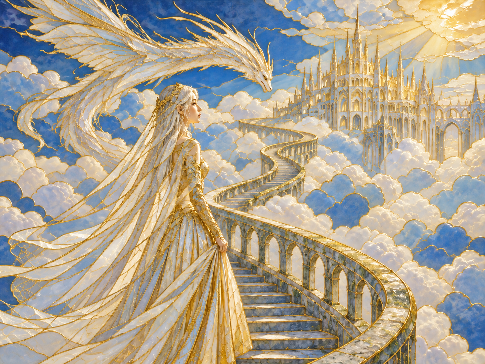
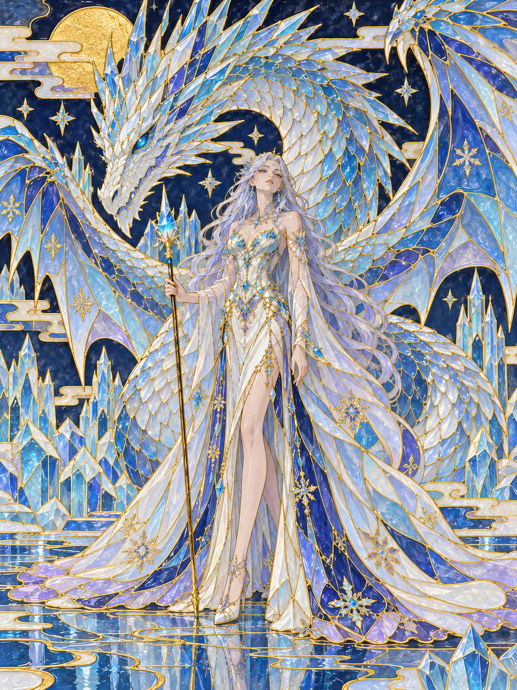
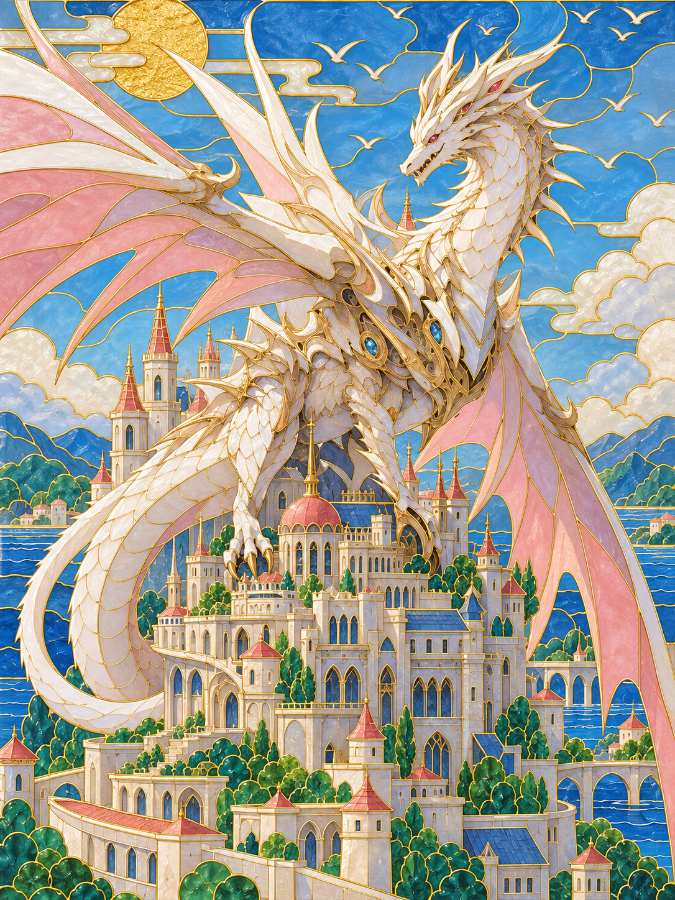
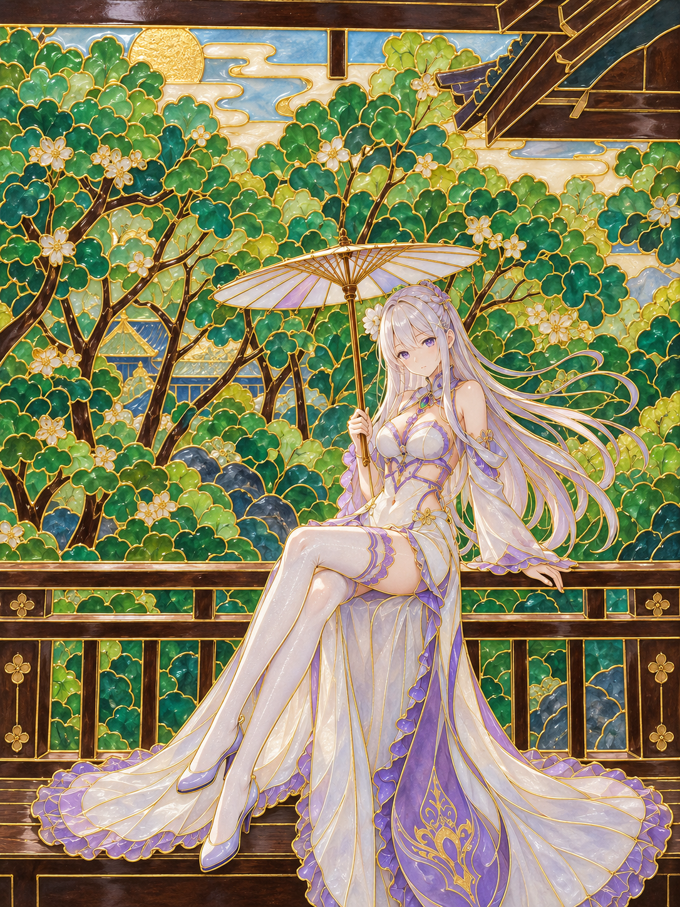

# Cloisonne Dream

A reusable image-restyling skill that converts a source image into a **modern luminous gold-wire cloisonne enamel illustration** while keeping the original scene, subjects, composition, and spatial relationships faithful.

> **Core principle: preserve the scene, redesign the surface.**

## What makes v0.3 distinctive

Cloisonne Dream is not just a material filter. Version 0.3 combines strict scene fidelity with bold surface-level art direction:

- **Identity Cells** — recognition-critical areas such as faces, landmark silhouettes, dragon heads, or signature objects. These stay readable and controlled.
- **Flow Cells** — directional forms such as hair, clothing folds, wings, scales, roads, water, branches, or cloud motion. These carry the richest and most decorative enamel segmentation.
- **Quiet Cells** — sky, walls, distant background, shadow masses, and other calm surfaces. These remain broader and less dense, but still polished and luminous.
- **Gold-Line Continuity** — one or two source-derived gold-line paths visually connect existing forms across the composition without inventing new objects.
- **Surface Creativity** — existing dresses, scales, wings, ice, water, architecture, foliage, and other surfaces may be made much more ornate and jewel-like as long as the scene itself is not rewritten.
- **Luminous Enamel Uplift** — source colors remain recognizable, but the result is allowed to become brighter, clearer, more radiant, and more premium than the raw source.

The repeatable visual system is now:

**Scene Fidelity → Identity / Flow / Quiet → Gold-Line Continuity → Bold Surface Redesign → Luminous Enamel Finish**

## Showcase

<table>
  <tr>
    <td align="center" width="50%">
      <br>
      <sub><b>Example 01</b> · Character / garden scene</sub>
    </td>
    <td align="center" width="50%">
      <br>
      <sub><b>Example 02</b> · Dragon / castle scene</sub>
    </td>
  </tr>
  <tr>
    <td align="center" width="50%">
      <br>
      <sub><b>Example 03</b> · Character / dragon scene</sub>
    </td>
    <td align="center" width="50%">
      <br>
      <sub><b>Example 04</b> · Fantasy architecture scene</sub>
    </td>
  </tr>
</table>

These examples show the material family. v0.3 further emphasizes brighter overall rendering, richer Flow Cell ornament, and strict separation between **new scene objects** and **surface decoration embedded in existing objects**.

## What it is

Cloisonne Dream is designed for image-to-image restyling where photographic or CGI micro-texture is undesirable. It replaces photo-like detail with clean enamel color fields, fine metallic partition lines, controlled glazed highlights, and handcrafted visual structure.

The style is intentionally strict at the scene level: it should not invent suns, moons, birds, stars, buildings, creatures, flowers, or other independent decorative elements unless they already exist in the source image or the user explicitly asks for them.

At the surface level, however, it is intentionally bold: existing clothing, scales, wings, water, ice, architecture, foliage, and other materials may receive richer internal enamel redesign.

## Repository structure

```text
cloisonne-dream/
├── .codex-plugin/
│   └── plugin.json
├── assets/
│   └── examples/
│       ├── example-01.png
│       ├── example-02.png
│       ├── example-03.png
│       └── example-04.png
├── skills/
│   └── cloisonne-dream/
│       ├── SKILL.md
│       ├── agents/
│       │   └── openai.yaml
│       └── references/
│           ├── style-rules.md
│           └── eval-cases.md
└── README.md
```

## Use in Codex

For local skill use, copy `skills/cloisonne-dream` into one of Codex's skill locations, for example:

```text
$HOME/.agents/skills/cloisonne-dream
```

Then invoke it explicitly with `$cloisonne-dream`, or choose it from `/skills`.

For distribution, this repository is also packaged as a skill-only plugin through `.codex-plugin/plugin.json`.

## Intended behavior

The skill should:

- preserve subject count, identity-defining features, pose, viewpoint, framing, and scene layout;
- preserve important source hue relationships while allowing a brighter luminous enamel uplift;
- separate the scene into Identity, Flow, and Quiet zones;
- concentrate line richness in directional Flow Cells rather than outlining everything equally;
- create one or two meaningful Gold-Line Continuity paths from existing geometry;
- allow bold internal surface redesign inside existing objects;
- convert photographic micro-detail into enamel cells and controlled linework;
- remove camera noise, grain, skin pores, and random photo texture;
- avoid unrelated scene-level decorative invention;
- remain clearly non-photographic and recognizably part of one consistent visual family.

## Golden rule for additions

**Do not add a new scene object just because it looks decorative.**

A motif is acceptable when:
- it genuinely exists in the source; or
- the user explicitly requests it; or
- it remains embedded as internal surface decoration within an existing source object.

## Version

Current draft: **0.3.0**

Version 0.3 adds a brighter luminous finish, stronger ornamental Flow Cells, and a clear rule: **scene structure stays conservative; existing surfaces may be boldly redesigned.**
